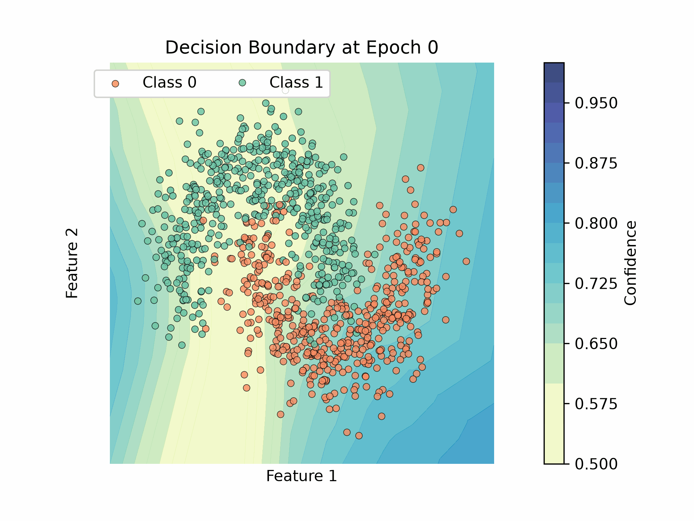
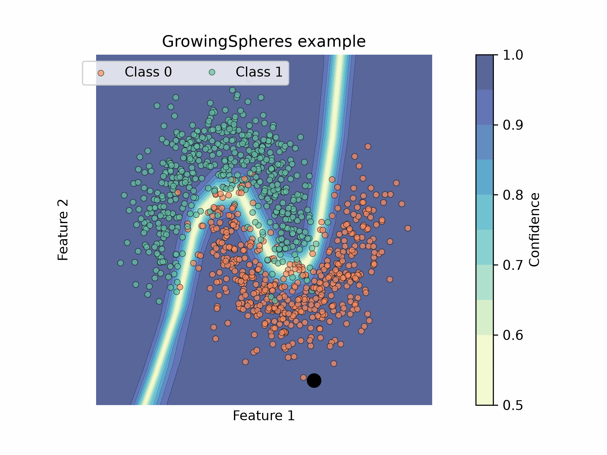

# scce-light

Lightweight version of [SC-CE](https://github.com/clarapunzi/SC-CE), Selective Classification via Counterfactual Explanations:
a model agnostic rejection-based abstention method for classifiers.

**Why is it lightweight:** It has no submodules and no pre-computed artifacts. The only dependencies are `numpy`, `scipy`, `pandas` and `scikit-learn`. 

## Intuition
The main idea is that a classifier abstains when a small change to the input, found by a counterfactual generator, is enough to flip its prediction. 
- Data focused
- Model agnostic
- Easy to use

<p align="center">
  
  &nbsp;
  
</p>

A classifier learns a decision boundary (left). For a given instance, a sphere grows around it until it reaches a point predicted with the other class: its closest counterfactual (right). If that distance is small, a small change can flip the prediction, so the classifier should abstain. scce-light implements this idea with the Growing Spheres counterfactual generator. The confidence of the model is not used at all to decide whether to abstain.

## Pipeline

| Module | Content |
|---|---|
| `scce_light/growing_spheres.py` | `GrowingSpheres`: self-contained port of the [SC-CE fork](https://github.com/valevalerio/growingspheres) (multiple counterfactuals per instance, sparsification), seeded and vectorised |
| `scce_light/distances.py` | `euclidean`, `aggregate` (`min` / `mean` / `max`) |
| `scce_light/pipeline.py` | `generate_counterfactuals`, `cf_distances` |
| `scce_light/rejectors.py` | `CFDistRejector` (SC-CE, empirical or Gamma quantiles), `PlugInRule` (confidence baseline) |
| `scce_light/metrics.py` | coverage, non-rejected accuracy, classification quality, rejection quality, `evaluate` |

## Pip install
To install the repo as a package, run either of the following commands:
```bash
pip install git+https://github.com/valevalerio/scce-light.git   # no clone needed
# or, after cloning/downloading anywhere:
pip install -e path/to/scce-light
```

## Quick start
```bash
jupyter notebook demo.ipynb
```
```python
from scce_light import GrowingSpheres, CFDistRejector, generate_counterfactuals, cf_distances

gs = GrowingSpheres(model.predict, n_in_layer=200, first_radius=0.05, decrease_radius=2.0, random_state=0)
d_cal = cf_distances(X_cal, generate_counterfactuals(gs, X_cal, num_cf=32), how='min')
d_test = cf_distances(X_test, generate_counterfactuals(gs, X_test, num_cf=32), how='min')

rejector = CFDistRejector(model).calibrate(d_cal, coverages=[0.9, 0.8, 0.7])
accepted = rejector.accept(d_test, coverage=0.8)   # True = predict, False = abstain
```

The demo notebook runs the whole pipeline on `make_classification` with an MLP. With the defaults it takes about 2-3 minutes on a laptop, most of it spent generating 32 counterfactuals for each of 1,200 instances. Lower `NUM_CF` for a quicker run.


## Differences from the full SC-CE code

- Only Growing Spheres. The full repository also has DiCE, LORE and ILS, as well as latent-space distances.
- Only the Euclidean distance; `cf_distances` accepts any `distance(cfs, x)` callable.
- No dataset loaders, nested cross-validation, Lipschitz MLP.
- Rejectors expose `accept(scores, coverage)`, a boolean mask for a given coverage, instead of `qband` indices.

## Citation
If you find this work useful, please cite the original paper:
```bibtex
@article{bonsignori2026scce,
  author  = {Bonsignori, V. and Punzi, C. and Pellungrini, R. and Giannotti, F.},
  title   = {``I know that I don't know... and I explain why'' Robust abstention via counterfactual explanations},
  journal = {IEEE Access},
  year    = {2026},
  doi     = {10.1109/ACCESS.2026.3705102}
}
```

The animations are generated by [Drawings/counterfactuals.ipynb](Drawings/counterfactuals.ipynb).